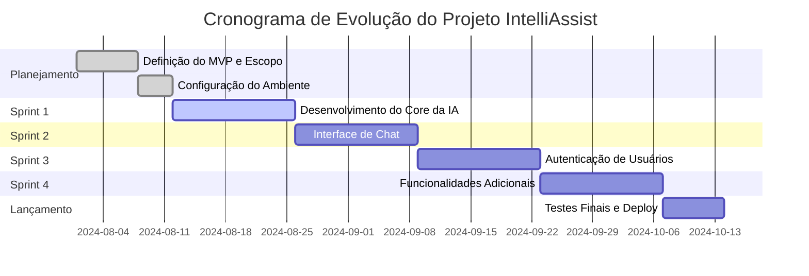

# IntelliAssist


## 🎯 Desafio

O IntelliAssist é uma plataforma inovadora projetada para democratizar o acesso à inteligência artificial, oferecendo um assistente virtual para auxiliar usuários em uma variedade de tarefas diárias. O desafio é criar uma solução intuitiva e poderosa que possa, por exemplo, ajudar estudantes a resumir textos complexos, auxiliar profissionais a automatizar tarefas repetitivas ou simplesmente organizar a rotina diária de qualquer pessoa, tornando a tecnologia de IA uma aliada acessível e prática no dia a dia.

## 📋 Backlog do Produto

O backlog completo do produto, com todas as épicas, histórias de usuário e tarefas, está detalhado em nossa ferramenta de gerenciamento.

➡️ **[Acesse o Backlog do Produto aqui](https://link-para-seu-backlog.com)**

## 🚀 Cronograma de Evolução

Abaixo está uma representação visual do nosso cronograma planejado para o desenvolvimento do IntelliAssist.



## Sprints

| Período da Sprint | Documentação da Sprint | Vídeo do Incremento |
| :---------------: | :--------------------: | :-----------------: |
| 12/08 - 25/08     | [Documentação Sprint 1](./Docs/SPRINTS_DOR_DOD.md#sprint-1) | [YouTube](https://youtube.com/link-para-video-sprint1) |
| 26/08 - 08/09     | [Documentação Sprint 2](./Docs/SPRINTS_DOR_DOD.md#sprint-2) | [YouTube](https://youtube.com/link-para-video-sprint2) |
| 09/09 - 22/09     | [Documentação Sprint 3](./Docs/SPRINTS_DOR_DOD.md#sprint-3) | [YouTube](https://youtube.com/link-para-video-sprint3) |
| 23/09 - 06/10     | [Documentação Sprint 4](./Docs/SPRINTS_DOR_DOD.md#sprint-4) | [YouTube](https://youtube.com/link-para-video-sprint4) |

## 🛠️ Tecnologias Utilizadas

<div align="left">
  
  
  
  
  
  
</div>

## 📁 Estrutura do Projeto

```
IntelliAssist/
├── Docs/
│   ├── CHECKLISTS_DOR_DOD.md
│   ├── SPRINTS_DOR_DOD.md
│   └── MANUAL_USUARIO.md
├── src/
│   ├── app/
│   ├── components/
│   ├── services/
│   └── ...
├── .gitignore
├── package.json
└── README.md
```

## 🚀 Como Executar o Projeto

Siga os passos abaixo para configurar e executar o projeto em seu ambiente local.

### Pré-requisitos

- [Node.js](https://nodejs.org/en/) (versão 18 ou superior)
- [npm](https://www.npmjs.com/) ou [Yarn](https://yarnpkg.com/)

### 1. Instalação

Clone o repositório e instale as dependências:

```bash
git clone https://github.com/seu-usuario/IntelliAssist.git
cd IntelliAssist
npm install
```

### 2. Execução

Para iniciar o servidor de desenvolvimento:

```bash
npm start
```

### 3. Testes

Para rodar os testes automatizados do projeto:

```bash
npm test
```

## 📚 Documentação

Toda a documentação do projeto, incluindo definições de pronto (DoD/DoR) e manuais, está centralizada na pasta `Docs`.

- 📄 **Checklists de DoR e DoD**
-  Sprint **DoR e DoD por Sprint**
- 📖 **Manual do Usuário**

## 🧑‍💻 Equipe

| Foto | Nome Completo | Papel no Projeto | Contato |
| :--: | :-----------: | :--------------: | :-----: |
|  | `Seu Nome Completo` | Product Owner |   |
|  | `Nome do Colega` | Scrum Master |   |
|  | `Nome do Colega` | Desenvolvedor |   |